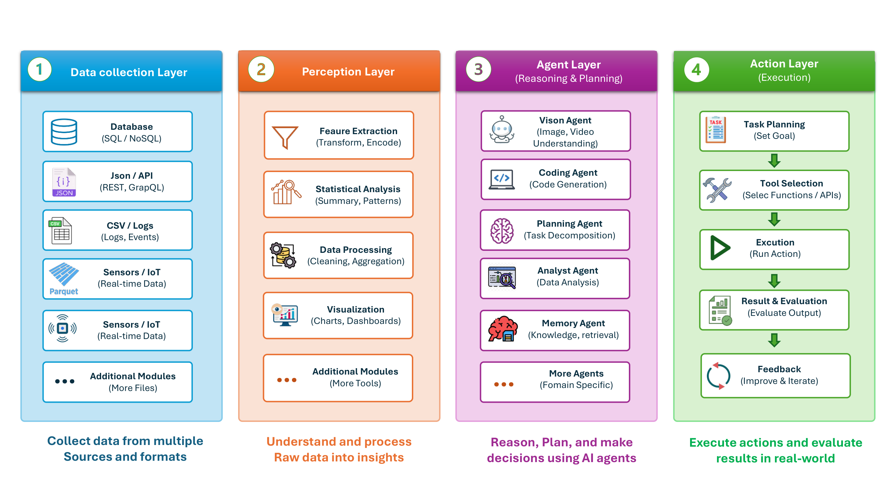

# 🧠 AgenticSensor: Interpretable Wearable Anomaly Diagnosis via Multi-Agent Reasoning

<p align="center">
  <a href="https://www.python.org/"></a>
  <a href="#"></a>
  <a href="#"></a>
  <a href="https://archive.ics.uci.edu/ml/datasets/mhealth+dataset"></a>
</p>

---

## 📐 Framework Architecture

This repository implements the **Perception Layer (Layer 2)** within the 4-layer System Architecture Framework:

<div align="center">
  
</div>

> **System Framework**: The Perception Layer processes raw multi-modal sensor streams (accelerometer, gyroscope, ECG) into structured diagnostic insights through feature transformation, statistical analysis, data cleaning, and multi-modal visual plot encoding for downstream reasoning agents.

---

## ✨ Key Capabilities

| Capability | Description |
| :--- | :--- |
| 💥 **Impact Diagnostics** | Detects physical collisions, fall patterns, and high-G acceleration spikes. |
| 🩺 **Health Monitoring** | Tracks physiological exertion, activity state changes, and heart rate anomalies. |
| 🛠️ **Sensor Fault Analysis** | Identifies hardware faults including dropouts, signal drift, zero-variance flatlines, and noise. |
| 🖥️ **Interactive GUI** | Full PyQt visual application for real-time sensor plot inspection and agent execution. |

---

## 📊 Quantitative Benchmark Results

**AgenticSensor** establishes new SOTA performance across detector-level perception grounding and end-to-end multimodal anomaly diagnosis ($n = 299$).

### 1. Detector-Level Performance (MHEALTH & PAMAP2)

| Model | MHEALTH F1 | MHEALTH Acc | PAMAP2 F1 | PAMAP2 Acc |
| :--- | :---: | :---: | :---: | :---: |
| MOMENT | 0.3076 | 0.4991 | 0.7320 | 0.6390 |
| GRU-AE | 0.3145 | 0.5009 | 0.5524 | 0.6606 |
| Linear-AE | 0.4174 | 0.5016 | 0.5373 | 0.6679 |
| TranAD | 0.7321 | 0.6964 | 0.4255 | 0.6169 |
| **AgenticSensor (Ours - CSCAD)** | **`0.9105`** | **`0.9103`** | **`0.9330`** | **`0.9330`** |

### 2. End-to-End Multimodal Anomaly Diagnosis ($n = 299$)

| System | State (TSA) | SemSim | Temporal (TIoU) | Event (EFA) | Event (TLC) |
| :--- | :---: | :---: | :---: | :---: | :---: |
| Codex | 0.3067 | 0.0940 | 0.1210 | 0.1700 | 0.2840 |
| Copilot | 0.4370 | 0.1090 | 0.3100 | 0.1510 | 0.3670 |
| SAGE | 0.7070 | 0.5907 | 0.4730 | 0.4530 | 0.4160 |
| TSAD-style | 0.1100 | 0.5080 | 0.2790 | 0.4110 | 0.5960 |
| **AgenticSensor (Vision Only)** | 0.1130 | 0.6670 | 0.6430 | 0.6830 | 0.7350 |
| **AgenticSensor (Ours)** | **`0.7880`** *(+11.5%)* | **`0.7640`** *(+29.3%)* | **`0.8300`** *(+75.5%)* | **`0.7230`** *(+59.6%)* | **`0.7670`** *(+28.7%)* |

> 🚀 **Diagnostic Gain**: By fusing multi-modal visual plots with statistical signal verification, **AgenticSensor** achieves **+75.5% relative gain in Temporal IoU** and **+59.6% in Event Frame Accuracy** over competing baselines.

---

## 🛠️ Quick Installation & Setup

1. **Clone repository:**
   ```bash
   git clone https://github.com/your-username/agentic-sensor-perception.git
   cd agentic-sensor-perception
   ```

2. **Set up virtual environment:**
   ```bash
   python -m venv env
   # On Windows: env\Scripts\activate
   # On Linux/macOS: source env/bin/activate
   ```

3. **Install dependencies:**
   ```bash
   pip install -r requirements.txt
   ```

---

## ⚡ Execution Commands

- **Batch Scenario Runner:**
  ```bash
  python perception_layer/main.py
  ```

- **Single Scenario Execution:**
  ```bash
  python perception_layer/main_2.py <scenario_id>
  ```

- **Interactive GUI Visualizer:**
  ```bash
  python perception_layer/gui.py
  ```
